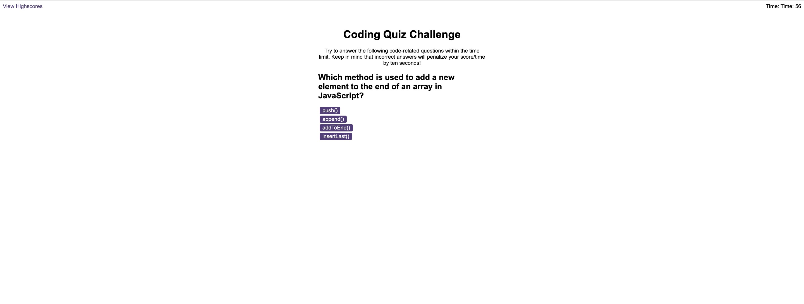

# Code Quiz App

## Description

My app is a timed coding quiz designed to help coding students practice their JavaScript fundamentals and compare their progress to their peers by storing high scores.

Please click here to the deployed site of my application: https://m-maha21.github.io/code-quiz-challenge-06/ 

## Table of Contents 

- [Description](#description)
- [Installation](#installation)
- [Usage](#usage)
- [License](#license)
- [Contribution](#contribution)
- [Credits](#credits)
- [Tools](#tools)

## Installation

N/A

## Usage

To use the Code Quiz App, please follow these steps:

1. The quiz features a start button that, when clicked, initiates a timer and displays the first question.
2. Questions are presented with multiple-choice answers, each represented by buttons.
3. When an answer is clicked, the quiz progresses to the next question.
4. If an incorrect answer is selected, time is deducted from the timer.
5. The quiz ends when either all questions are answered or the timer reaches 0.
6. Upon game end, the user's score is displayed, indicating how many questions were answered correctly within the allotted time.
7. The user is provided with the ability to save their initials and their score, facilitating comparison with other users.

## Screenshot 

## License
N/A

## Contribution

N/A

## Credits

Name: Mahamuda
GitHub: m-maha21

## Tools

The tools that I have used in project are: JavaScript, JSON, GitHub, CSS & HTML

